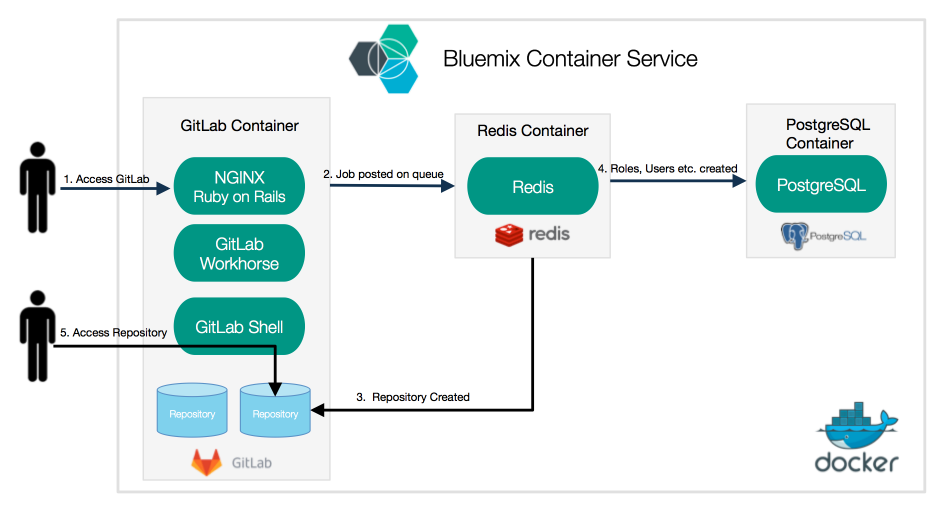
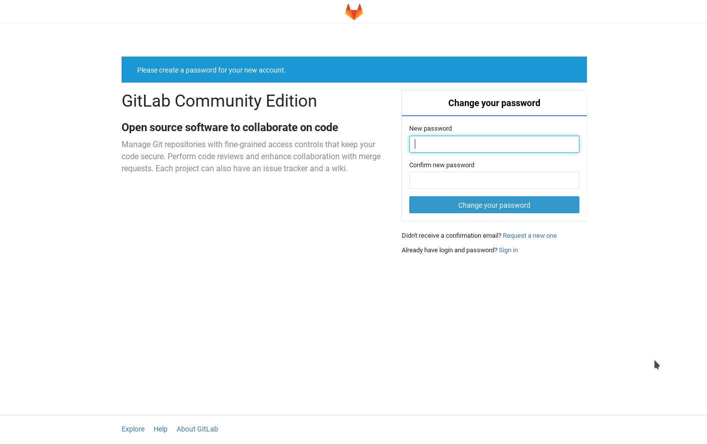
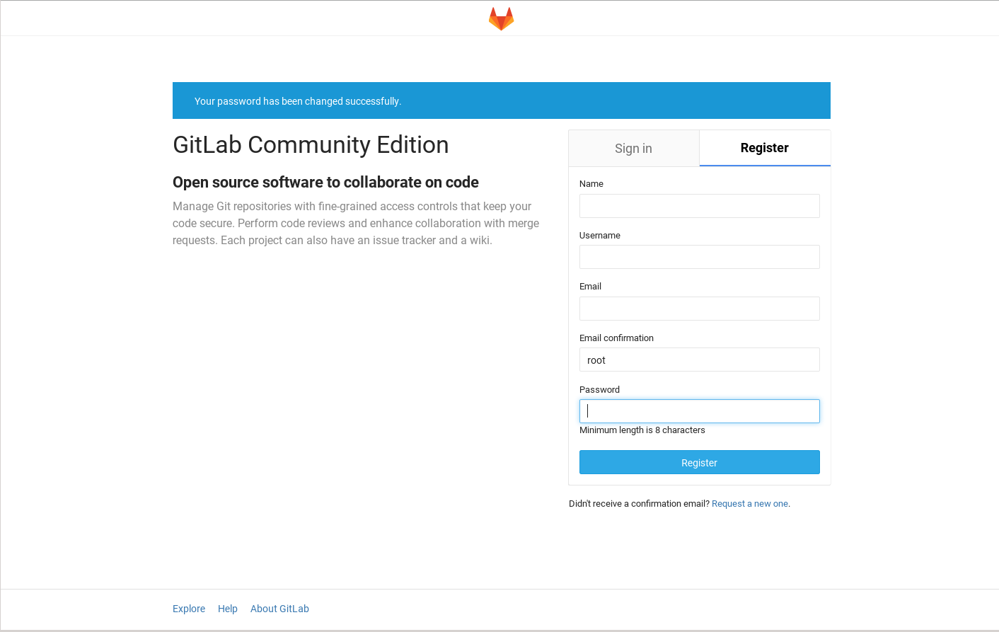
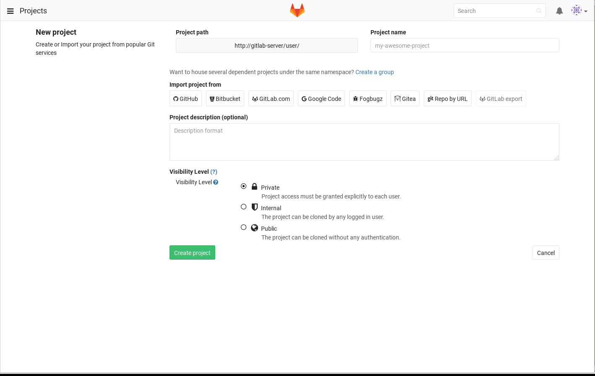

[](https://travis-ci.org/IBM/container-service-gitlab-sample)

[](https://bluemix.net/deploy?repository=https://github.com/AnthonyAmanse/container-service-gitlab-sample)

# GitLab deployment on Bluemix Container Service

## Overview
This project shows how a common multi-component application can be deployed
on the Bluemix container service. Each component runs in a separate container
or group of containers. 

Gitlab represents a typical multi-tier app and each component will have their own container(s). The microservice containers will be for the web tier, the state/job database with Redis and PostgreSQL as the database.




## Included Components
- Bluemix container service
- GitLab
- NGINX
- Redis
- PostgreSQL

## Steps

1. [Instal Bluemix and Container Service CLI Tools](#1-install-cli-tools)
2. [Build PostgreSQL, Redis and Gitlab containers](#2-build-containers)
3. [Deploy containers](#3-deploy-containers)
4. [Using Gitlab](#4-using-gitlab)

# 1. Install Bluemix and Container Service CLI tools
Install CloudFoundry CLI for your OS from [GitHub] (https://github.com/cloudfoundry/cli/releases). Once the CloudFoundry CLI
has been installed you can install the Bluemix Container Service Cloud Foundry plug-in.

```bash
cf install-plugin https://static-ice.ng.bluemix.net/ibm-containers-linux_x64
```

Once the plugin is installed you can log into the Bluemix Container Service.
First, you must log into Bluemix through the CloudFoundry CLI.

```bash
cf login -a https://api.ng.bluemix.net
```

If this is the first time using the container service you must initialize the plugin and
set a namespace which identifies your private Bluemix images registry. It can be between 4 and 30 characters.

```bash
cf ic init
cf ic namespace set <namespace>
```

Then you must log into the Bluemix Container Service.

```bash
cf ic login
```

Verify that it works.

```bash
cf ic images
```

This should return a list of images from the default Bluemix registry.

        REPOSITORY                                            TAG                 IMAGE ID            CREATED             SIZE
        registry.ng.bluemix.net/ibmnode                       v1.2                640ed14065df        5 weeks ago         188 MB
        registry.ng.bluemix.net/ibmliberty                    microProfile        50854bcc98c3        2 months ago        237 MB
        registry.ng.bluemix.net/ibm-backup-restore            latest              4b5d9037c97a        5 weeks ago         208 MB
        registry.ng.bluemix.net/ibmliberty                    javaee7             96285b81d9df        2 months ago        314 MB
        registry.ng.bluemix.net/ibmliberty                    latest              96285b81d9df        2 months ago        314 MB
        registry.ng.bluemix.net/ibm-websphere-extreme-scale   latest              f98d12aad014        8 days ago          466 MB
        registry.ng.bluemix.net/ibm-node-strong-pm            latest              3fc4ae24eb0e        4 weeks ago         259 MB
        registry.ng.bluemix.net/ibmnode                       v1.1                fd4d70c5451b        5 weeks ago         181 MB
        registry.ng.bluemix.net/ibm-integration-bus           latest              ec198557875c        5 weeks ago         683 MB
        registry.ng.bluemix.net/ibmnode                       latest              acec21732cb5        5 weeks ago         192 MB
        registry.ng.bluemix.net/ibmnode                       v4                  acec21732cb5        5 weeks ago         192 MB
        registry.ng.bluemix.net/ibm-mq                        latest              9b6ae7557a34        8 days ago          771 MB
        registry.ng.bluemix.net/ibm_wa_agent                  latest              3d38f3e80fd7        2 weeks ago         435 MB
        registry.ng.bluemix.net/ibmliberty                    webProfile6         211f521035a2        2 months ago        268 MB
        registry.ng.bluemix.net/ibmliberty                    webProfile7         6b2b8341fa32        2 months ago        276 MB


# 2. Build PostgreSQL, Redis and Gitlab containers

Build the PostgreSQL container.

```bash
cd containers/postgresql
cf ic build -t registry.ng.bluemix.net/<namespace>/gitlab-postgres .
```

Build the Gitlab container.

```bash
cd containers/gitlab
cf ic build -t registry.ng.bluemix.net/<namespace>/gitlab .
```

The redis container from Docker Hub can be used without modification so it just needs to be imported.

```bash
cf ic cpi redis:alpine registry.ng.bluemix.net/<namespace>/redis
```

# 3. Deploy containers

Before the containers can run volumes must be created.

```bash
cf ic volume create postgresql
cf ic volume create redis
cf ic volume create gitlab
```

Containers can now be deployed with the provided docker-compose file.
In order to use docker-compose you MUST override the local Docker environment
as described in "Option 2" when logging into the Bluemix container service.

If you do not already have docker-compose installed:

```bash
curl -L "https://github.com/docker/compose/releases/download/1.11.2/docker-compose-$(uname -s)-$(uname -m)" -o /usr/local/bin/docker-compose ; chmod +x /usr/local/bin/docker-compose
```

```bash
(in the toplevel repo directory)
NAMESPACE=<namespace> docker-compose up -d
```

Or manually.

```bash
cf ic run -d --name pgsql --volume postgresql:/var/lib/postgresql registry.ng.bluemix.net/<namespace>/gitlab-postgresql
cf ic run -d --name redis --volume redis:/var/lib/redis registry.ng.bluemix.net/<namespace>/redis
cf ic run -d --volume gitlab:/home/git/data --link pgsql:postgresql --link redis:redis --publish 10022:22 --publish 10080:80 gitlab
```

Now a public IP can be bound to the Gitlab container.
```bash
cf ic ip request
cf ic ip list
cf ic ip bind <unbound IP from above> <gitlab container ID>
```

Verify everything is running by visiting <bound IP> in a browser which should result in a Gitlab screen prompting you to change the root password.



# 4. Using Gitlab
Now that Gitlab is running you can register as a new user and create a project.




After logging in as your newly-created user you can create a new project.



Once a project has been created you'll be asked to add an SSH key for your user.

To verify that your key is working correctly run:

```bash
ssh -T git@<IP>
```

Which should result in:

```bash
Welcome to GitLab, <user>!
```

Now you can clone your project.
```bash
git clone <project URL>
```

Add a file and commit:
```bash
echo "Gitlab project" > README.md
git add README.md
git commit -a -m "Initial commit"
```

You can now see it in the Gitlab UI.


# Troubleshooting
If a container doesn't start examine the logs.
```bash
cf ic ps
cf ic logs -t <container ID>
```

# License
[Apache 2.0](LICENSE.txt)
